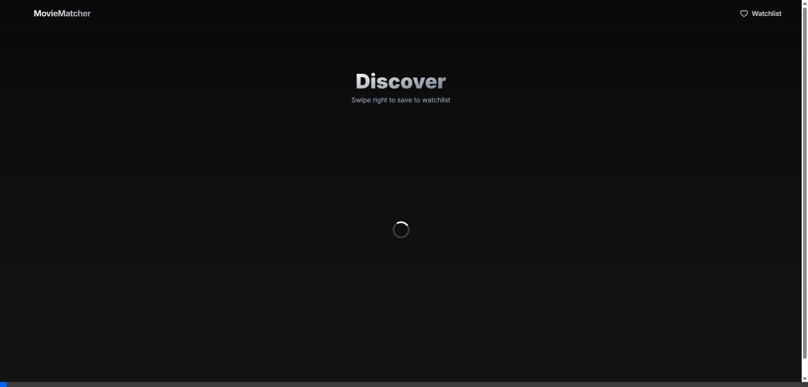
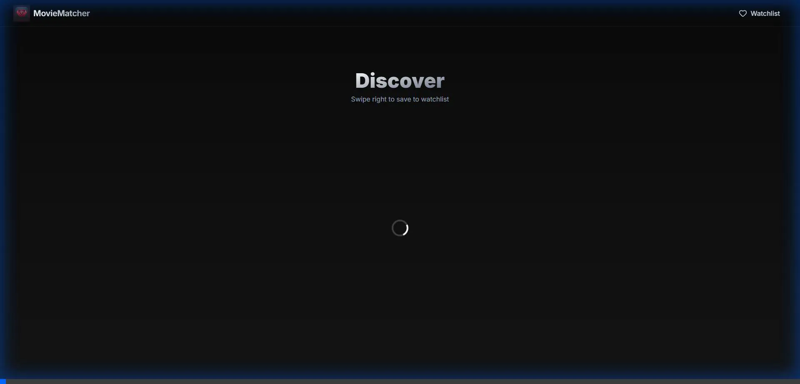
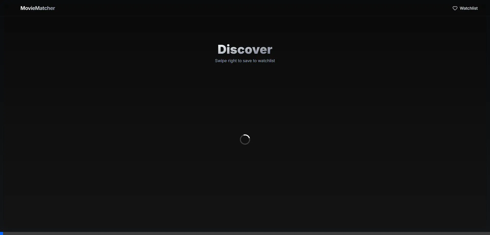

# Movie Matchmaker

A Tinder-style movie discovery application built with Next.js, Framer Motion, and Tailwind CSS. Users can swipe right to "like" movies (add to watchlist) and swipe left to dismiss them.

## Demos

<div align="center">
  <h3>Discovery & Swiping</h3>
  

  <h3>Watch Trailers</h3>
  

  <h3>Manage Watchlist</h3>
  
</div>

## Features

*   **Tinder-Style Swiping**: Intuitive gesture-based interface for browsing movies.
*   **Discovery Filters**: Filter movies by Genre, Year, Rating, Runtime, and Sort Order (Popularity, Release Date, etc.) to refine your recommendations.
*   **Infinite Scrolling**: "Load More" functionality keeps the movie suggestions coming.
*   **Watchlist Management**: View, manage, and remove movies from your saved list.
*   **Responsive Design**: Fully optimized for mobile and desktop experiences.
*   **Glassmorphism UI**: Modern, sleek interface with blur effects and smooth animations.

## Tech Stack

*   **Framework**: [Next.js](https://nextjs.org/) (App Router)
*   **Styling**: [Tailwind CSS](https://tailwindcss.com/)
*   **Animations**: [Framer Motion](https://www.framer.com/motion/)
*   **State Management**: [Zustand](https://github.com/pmndrs/zustand) (with persistence)
*   **Icons**: [Lucide React](https://lucide.dev/)
*   **Data Source**: [TMDB API](https://www.themoviedb.org/documentation/api)

## Setup Instructions

1.  **Clone the repository**:
    ```bash
    git clone https://github.com/richaross/moviematcher.git
    cd moviematcher
    ```

2.  **Install dependencies**:
    ```bash
    npm install
    ```

3.  **Configure Environment Variables**:
    Create a `.env.local` file in the root directory and add your TMDB API key:
    ```env
    NEXT_PUBLIC_TMDB_API_KEY=your_api_key_here
    ```

4.  **Run the development server**:
    ```bash
    npm run dev
    ```

5.  Open [http://localhost:3000](http://localhost:3000) with your browser to see the result.

## Future Updates

This project is actively evolving. Here are the planned features for the next release:

1.  **Review System**: Implementation of a personal review and rating system for movies in the watchlist.
2.  **Watchlist Filtering**: Advanced filtering and sorting options directly within the `/watchlist` page (e.g., sort by rating, filter by watched status).
3.  **Watched Status**: A toggle function to mark movies in the watchlist as "Watched" or "Not Yet Watched" to better organize your viewing history.
